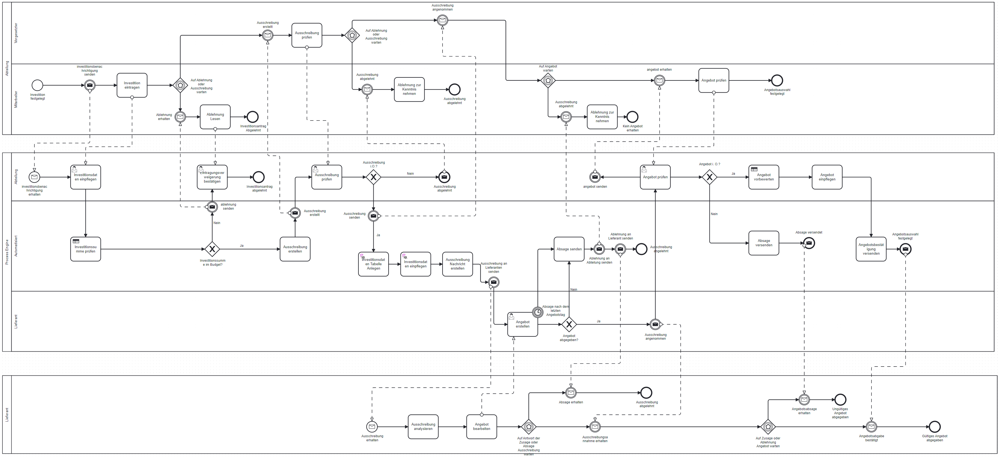

# Investment Prozess | Business Process Technologies

## Table of Content

1. [Investment Prozess | Business Process Technologies](#investment-prozess--business-process-technologies)
2. [Camunda Docker (compose) Documentation](#camunda-docker-compose-documentation)
3. [Projektstruktur](#projektstruktur)
4. [main.bpmn - Hauptprozess](#mainbpmn---hauptprozess)
5. [Requirements](#requirements)
6. [🚀 **Projekt Starten (Process, Worker & Deployment**)](#-projekt-starten-prozess-worker--deployment)
    - [**Docker installation**](#docker)
   - [**Lokale Installation**](#local)
   - [**Umgebungsvariablen setzen**](#setup-environment-variables)
   - [**Prozess ausführen und deployen**](#run-and-deploy-the-process)
   - [(dev) Demos ausführen](#run-the-demos)
7. [URLs](#urls)
   - [PostgreSQL](#postgresql)
   - [Camunda Dienste](#camunda)
   - [Camunda Modeler](#camunda-modeler)
8. [Camunda starten (Lokal)](#launch-camunda-lokal)
   - [PostgreSQL & Camunda 8](#postgresql--camunda-8)
   - [Camunda Volumes löschen](#delete-camunda-volumes)
   - [Camunda Docker-Compose starten](#camunda-docker-compose-starten)
9. [Weitere Optionen](#other-options)
   - [Full-Stack Deployment](#full-stack)
   - [Minimal Setup](#minimal-setup)
   - [Camunda Web Modeler](#camunda-web-modeler)

---

### Prozess (Camunda Modeler)



## Quickstart: Prozess Starten

alle unten beschriebenen Schritte können auch optional mit einem Startskript durchgeführt werden.
nach der ausführung des skriptes sollte camunda in docker laufen und der prozess gestartet sein

```
sh launch.sh
```

## Camunda Docker (compose) Documentation

[Camunda Docker (compose) Documentation](https://github.com/camunda/camunda-platform?tab=readme-ov-file#using-docker-compose)

## Projektstruktur

```
.
├── camunda-platform # 8.6 platform tools
├── src/
|──   index.ts
│   ├── bpmn/
│   │   ├── testing/
│   │   │   └── ...
│   │   └── main.bpmn <-- main process
│   ├── dmn/
│   │   └── ...
│   ├── forms/
│   │   └── ...
│   └── workers
├── package.json
├── yarn.lock
└── tsconfig.json
```

## main.bpmn - Hauptprozess

Finales BPMN (hier sollten wir Stück für Stück vorgehen und dafür sorgen, dass diese Datei immer deployt werden kann).

## Requirements

Um das Projekt zu starten, werden folgende Tools benötigt:

- [Docker](https://www.docker.com/)
- [Camunda Modeler](https://camunda.com/de/download/modeler/)

Falls Docker nicht genutzt wird:

- Node.js
- Yarn
- Camunda Modeler

---

# 🚀 **Projekt Starten** (Process, Worker & Deployment)

Es gibt 2 Arten das Projekt zu starten. Entweder schritt für Schritt lokal oder mit einem einzigen Befehl über docker was wir 
empfehlen würden. Die lokale option sollte nur in erwähgung gezogen werden wenn die Docker variante unerwartete probleme verursachen sollte.

## 🐋 Docker (empfohlen) 

**step 1: run camunda**
```bash
docker-compose -f camunda-platform/docker-compose/camunda-8.6/docker-compose.yaml up -d
```

**step 2: run workers and process deployment only**
```
docker-compose up -d --build
```

dadurch werden zwei compose elemente erzeugt:
* ``camunda-86``: enthält alle container bezüglich des camunda frameworks (full stack)
* ``bpt_investment_process``: enthält die postgreSQL Datenbank und die Zeebe Worker welche für den Prozess benötigt werden
   - postgres datenbank
   - pgadmin
   - worker client

**problembehandlung**

bei problemen mit camunda kann man probieren die volumes zu löschen und somit camunda vollständig zurückzusetzen und neu zu 
starten:
```bash
docker volume ls --format '{{.Name}}' | grep '^camunda' | xargs docker volume rm
```

## 💻 Local
node.js wird benötigt

### Install yarn:
projekt öffnen und folgendes ausführen
```bash
npm install --global yarn
```

### Install dependencies:
die nötigen packages installieren:
```bash
yarn install
```

### launch script nutzen

jetzt können wir das launch script in einer bash umgebung starten
```bash
./launch.sh
```

oder manuell mit den folgenden schritten: 

### Setup environment variables (**bash!**):
bevor wir unsere worker starten können müssen wir dem client folgende umgebungsvariablen zur verfügung stellen
```bash
export ZEEBE_ADDRESS='localhost:26500'
export ZEEBE_CLIENT_ID='zeebe'
export ZEEBE_CLIENT_SECRET='zecret'
export CAMUNDA_OAUTH_URL='http://localhost:18080/auth/realms/camunda-platform/protocol/openid-connect/token'
export CAMUNDA_TASKLIST_BASE_URL='http://localhost:8082'
export CAMUNDA_OPERATE_BASE_URL='http://localhost:8081'
export CAMUNDA_OPTIMIZE_BASE_URL='http://localhost:8083'
export CAMUNDA_MODELER_BASE_URL='http://localhost:8070/api'
export CAMUNDA_SECURE_CONNECTION=false
```

Wenn man PowerShell verwendet:
```powershell
$env:ZEEBE_ADDRESS = 'localhost:26500'
$env:ZEEBE_CLIENT_ID = 'zeebe'
$env:ZEEBE_CLIENT_SECRET = 'zecret'
$env:CAMUNDA_OAUTH_URL = 'http://localhost:18080/auth/realms/camunda-platform/protocol/openid-connect/token'
$env:CAMUNDA_TASKLIST_BASE_URL = 'http://localhost:8082'
$env:CAMUNDA_OPERATE_BASE_URL = 'http://localhost:8081'
$env:CAMUNDA_OPTIMIZE_BASE_URL = 'http://localhost:8083'
$env:CAMUNDA_MODELER_BASE_URL = 'http://localhost:8070/api'
$env:CAMUNDA_SECURE_CONNECTION = 'false'
```

### ❗❗ **Run and deploy the process**:
```bash
npx ts-node src/index.ts
```

## Datenbank

## pgadmin - mit datenbank verbinden

todo

## (Dev) Run the demos

### Start event (single pool)
```bash
npx ts-node demo_message_start_events.ts
```

### Throwing event (multi pools)
```bash
npx ts-node demo_message_throwing_event.ts
```

## URLs

### PostgreSQL
* [http://localhost:5050/](http://localhost:5050/)

### Camunda Dienste
* Operate: [http://localhost:8081](http://localhost:8081)
* Tasklist: [http://localhost:8082](http://localhost:8082)
* Optimize: [http://localhost:8083](http://localhost:8083)
* Identity: [http://localhost:8084](http://localhost:8084)
* Elasticsearch: [http://localhost:9200](http://localhost:9200)

### Camunda Modeler
* [http://localhost:8070/](http://localhost:8070/)

## Launch Camunda (Lokal)

### PostgreSQL + Camunda 8

#### Camunda Platform + PostgreSQL Server

**Camunda Volumes löschen (Bash):**
```bash
docker volume ls --format '{{.Name}}' | grep '^camunda' | xargs docker volume rm
```

**PowerShell:**
```powershell
docker volume ls --format "{{.Name}}" | Where-Object { $_ -match '^camunda' } | ForEach-Object { docker volume rm $_ }
```

**Camunda starten:**
```bash
docker-compose up -d && docker-compose -f camunda-platform/docker-compose/camunda-8.6/docker-compose.yaml up -d
```

---

## Weitere Optionen

### Full-Stack Deployment:
```bash
docker compose -f camunda-platform/docker-compose/camunda-8.6/docker-compose.yaml up -d
```

### Minimal Setup:
```bash
docker compose -f camunda-platform/docker-compose/camunda-8.6/docker-compose-core.yaml up -d
```

Camunda ist nun unter der URL **[http://localhost:8080](http://localhost:8080)** erreichbar.

Das Standard-Benutzerkonto ist **demo/demo**.

### Camunda Web Modeler:
```bash
docker compose -f camunda-platform/docker-compose/camunda-8.6/docker-compose-web-modeler.yaml up -d
