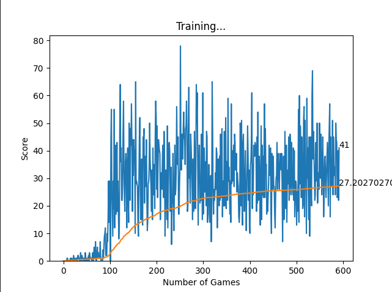

# Training Results "default"

## Details

### Model
* Learning Rate: ``0.001``
* batch size: ``500``

### Reward / Penalty
* moving, no special event: ``+0``
* eat apple: ``+10``
* collision ``-10``
